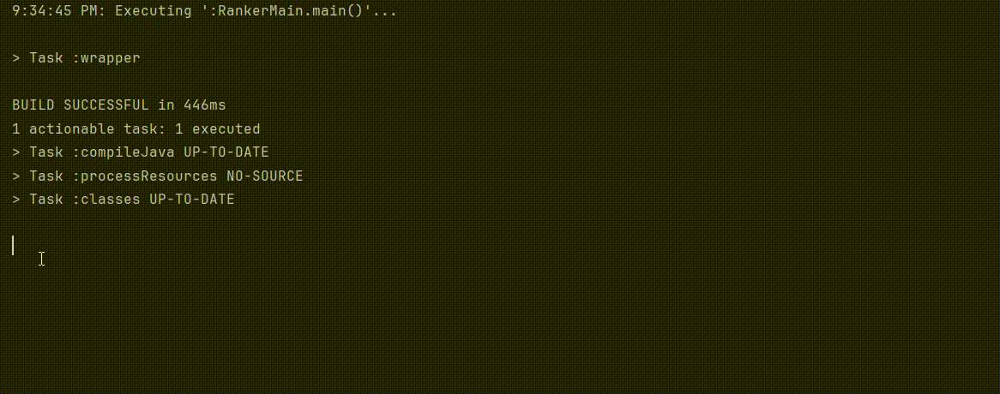
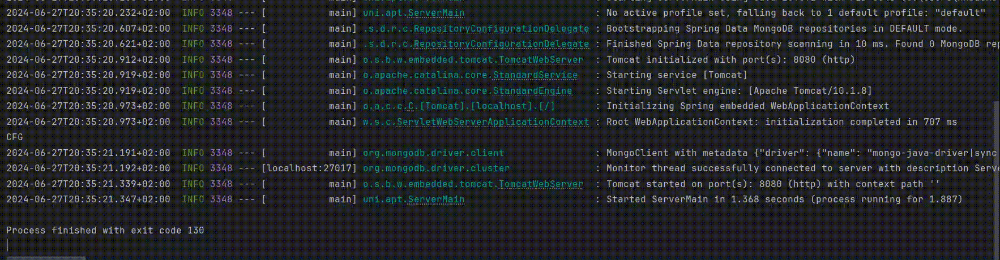

<a name="readme-top"></a>

[![Contributors][contributors-shield]][contributors-url]
[![Forks][forks-shield]][forks-url]
[![Stargazers][stars-shield]][stars-url]
[![Issues][issues-shield]][issues-url]
[![MIT License][license-shield]][license-url]

[contributors-shield]: https://img.shields.io/github/contributors/AbdoWise-z/Irminsul-backend?style=for-the-badge
[contributors-url]: https://github.com/AbdoWise-z/Irminsul-backend/graphs/contributors

[forks-shield]: https://img.shields.io/github/forks/AbdoWise-z/Irminsul-backend?style=for-the-badge
[forks-url]: https://github.com/AbdoWise-z/Irminsul-backend/network/members

[stars-shield]: https://img.shields.io/github/stars/AbdoWise-z/Irminsul-backend?style=for-the-badge
[stars-url]: https://github.com/AbdoWise-z/Irminsul-backend/stargazers

[issues-shield]: https://img.shields.io/github/issues/AbdoWise-z/Irminsul-backend?style=for-the-badge
[issues-url]: https://github.com/AbdoWise-z/Irminsul-backend/issues

[license-shield]: https://img.shields.io/github/license/AbdoWise-z/Irminsul-backend?style=for-the-badge
[license-url]: https://github.com/AbdoWise-z/Irminsul-backend/blob/master/LICENSE.txt

<!-- PROJECT LOGO -->
<br />
<div align="center">
  <a href="https://github.com/AbdoWise-z/Irminsul-backend">
    
  </a>

<h3 align="center">Irminsul</h3>
  <p align="center">
    The backend Repo of the irminsul search engine project.
    <br />
    <br />
    <a href="https://github.com/AbdoWise-z/Irminsul-backend/tree/main/cpu"><strong>Explore</strong></a>
    <br />
    <a href="https://github.com/AbdoWise-z/Irminsul-backend/tree/main/assembler">Assembler</a>
    ·
    <a href="https://github.com/AbdoWise-z/Irminsul-backend/tree/main/images">Images</a>
    ·
    <a href="https://github.com/AbdoWise-z/Irminsul-backend/issues">Request Feature</a>
  </p>
</div>

<!-- TABLE OF CONTENTS -->
## Table of Contents
<ol>
<li>
    <a href="#about-the-project">About The Project</a>
    <ul>
        <li><a href="#built-with">Built With</a></li>
        <li><a href="#features">Features</a></li>
        <li><a href="#modules">Modules</a></li>
        <li><a href="#end-points">End points</a></li>
    </ul>
</li>
<li>
    <a href="#getting-started">Getting Started</a>
    <ul>
        <li><a href="#setting-up-db">Setting Up DB</a></li>
        <li><a href="#crawling-and-indexing">Crawling & Indexing</a></li>
        <li><a href="#setting-up-server">Setting Up Server</a></li>
    </ul>
</li>
    <li><a href="#contributing">Contributing</a></li>
    <li><a href="#license">License</a></li>
    <li><a href="#contact">Contact</a></li>
</ol>

<!-- ABOUT THE PROJECT -->
## About The Project

This repo features a search engine written in java.
<br>

The Search engine is divided into the modules:
<div><ol>
<li> Crawler </li>
<li> Indexer </li>
<li> Ranker </li>
<li> Server </li>
</ol>
</div>
each of these modules will be discussed in the <a href="#modules">Modules</a> section of this repo.

### Built With

The project was divided into two parts
* Part 1: The backend server, Written in Java | Spring Boot
* Part 2: <a herf="https://github.com/AbdoWise-z/Irminsul-ui">The UI</a>, Written in Dart | Flutter


<p align="right">(<a href="#readme-top">back to top</a>)</p>

## Features
The project features a powerful multithreaded search engine written in java. using Algorithms such
word's popularity and website's popularity it can give accurate search results for the user query.
It also supports giving the user suggestions based on other users frequent searches.

## Modules
#### Crawler
A powerful crawler written in java that is capable of extracting useful information
such as: 
* Links
* Paragraphs
* Titles

from Web pages and storing it into a database for the indexer to process, the crawler can
run with arbitrary number of threads (best option is to be the same as the number of threads supported by 
the cpu itself). and can work with any type of database (provided you implement the database interface).
<br>
<br>

<center style="margin-top: -20px;padding: 0;">Crawler in action</center>
<p align="right">(<a href="#readme-top">back to top</a>)</p>

#### Indexer
The Indexer module takes in the output of the crawler and process it, to find useful words that can help
the search engine determine which website is more likely to contain an information about the search query
the idea.
It's responsible for extracting information such as:
* How much was a word mentioned inside a website.
* Where was the word mentioned.
* Detect if this word is spam or not.
  <br>
  <br>
  
<center style="margin-top: -20px;padding: 0;">Indexer in action</center>
<p align="right">(<a href="#readme-top">back to top</a>)</p>


#### Ranker
This module is responsible for receiving the user search query, and then output likes (pages)
that are likely to be tied with this query.
<br>
<br>

<center style="margin-top: -20px;padding: 0;">Ranker search example</center>
<p align="right">(<a href="#readme-top">back to top</a>)</p>


#### Server
A spring bot server to allow the application to receive search requests from
the web, see the <a href="#end-points">End pints</a> section for more information.
<br>
<br>

<center style="margin-top: -20px;padding: 0;">Springbot Server</center>
<p align="right">(<a href="#readme-top">back to top</a>)</p>


## End Points
The SpringBot server has the following end-points.

GET `/test` tests whether the server is up or not.

GET `/Query?q=...` takes in one parameter: `q`, and returns search suggestions based on the value of `q`

GET `/search?q=...` takes in one parameter: `q`, and returns the search result of it.

POST `/translate` takes in the value of a search query, and converts the ids values into strings (its actual values)
for more information, see how we used it inside our font-end demo.
<p align="right">(<a href="#readme-top">back to top</a>)</p>

<!-- GETTING STARTED -->
## Getting Started
Before you begin, ensure you have the following installed on your local machine:

- Java Development Kit (JDK) 8 or higher
- Apache Maven
- Git

then you need to clone the repo using: 
```bash
git clone https://github.com/AbdoWise-z/Irminsul-backend.git
cd Irminsul-backend
```
you will need a code editor like IDEA or Eclipse to develop, checkout their guids on
how to set up a SpringBot project before you proceed.

#### Setting Up DB
We already implemented the project to work with MongoDB, so all you need to do is installing it
from the official mongo website, and you are good to go (you may need to change the connection
string if you plan to use an online DB)

for any other type of DB, then you need to implement `IndexerStorage` interface to work with the
specific type of DB you want.

#### Crawling and Indexing
For crawling and indexing, use the corresponding java main file to run the process you want.
For example, if you want to run the crawler, then you need to run the main function inside
`CrawlerMain`, likewise `IndexerMain` for indexing. It's not recommended to interrupt the crawler
/indexer process while it's running.

#### Setting Up Server
You can run SpringBot Server by simply running `ServerMain`.

<p align="right">(<a href="#readme-top">back to top</a>)</p>

<!-- CONTRIBUTING -->
## Contributing

Contributions are what make the open source community such an amazing place to learn, inspire, and create. Any contributions you make are **greatly appreciated**.

This project was developed by
<table>
<tr>

<td align="center">
<a href="https://github.com/AbdoWise-z" target="_black">
<br /><sub><b>Abdulrahman Mohammed</b></sub> <br/></a>
</td>

<td align="center">
<a href="https://github.com/Elkapeer" target="_black">
<br /><sub><b>Osama Saleh</b></sub><br/></a>
</td>

<td align="center">
<a href="https://github.com/amr-salahuddin" target="_black">
<br /><sub><b>Amr Salahuddin</b></sub><br/></a>
</td>

<td align="center">
<a href="https://github.com/Hefney" target="_black">
<br /><sub><b>Abdulrahman Hefney</b></sub><br/></a>
</td>

</tr>
 </table>

If you have a suggestion that would make this better, please fork the repo and create a pull request. You can also simply open an issue with the tag "enhancement".
Don't forget to give the project a star! Thanks again!

1. Fork the Project
2. Create your Feature Branch (`git checkout -b feature/AmazingFeature`)
3. Commit your Changes (`git commit -m 'Add some AmazingFeature'`)
4. Push to the Branch (`git push origin feature/AmazingFeature`)
5. Open a Pull Request

<p align="right">(<a href="#readme-top">back to top</a>)</p>

<!-- LICENSE -->
## License

Distributed under the MIT License. See `LICENSE.txt` for more information.

<p align="right">(<a href="#readme-top">back to top</a>)</p>

<!-- CONTACT -->
## Contact

[Abdulrahman Mohammed Abdulfattah](https://www.linkedin.com/in/abdo-mohamed-5b3506252/) - <moh2002.abdow@gmail.com>

<p align="right">(<a href="#readme-top">back to top</a>)</p>

<!--difiniations -->


